# 🧠 Local RAG Document Q&A Chatbot

> Ask questions about your PDFs in natural language — 100% local, 100% private.
> Powered by **Ollama**, **ChromaDB**, and **Streamlit**.


---

## ✨ Features

| Feature | Details |
|---|---|
| 📄 **PDF Upload** | Drag & drop any PDF — text is extracted page-by-page |
| 🔪 **Smart Chunking** | Page-aware 800-char overlapping chunks preserve context |
| 🧲 **Semantic Embeddings** | Converts text to vectors using `nomic-embed-text` via Ollama |
| 🗄️ **ChromaDB Vector Store** | Persistent local vector DB — no cloud, no server needed |
| 🤖 **Local LLM** | Streams answers from `deepseek-r1:7b` (or any pulled model) |
| 🔍 **Source Highlighting** | Retrieved PDF passages shown with query keywords highlighted in yellow |
| 💬 **Chat History** | Full multi-turn conversation with session memory |
| 🔄 **Auto Model Detection** | Dropdowns auto-populate with your locally pulled Ollama models |
| 🔒 **100% Private** | All data stays on your machine — no API keys, no internet required |

---

## 📐 Architecture & Pipeline

```mermaid
graph TD
    subgraph Ingestion["📥 Document Ingestion"]
        A[PDF Upload] --> B[Text Extraction<br><i>PyPDF — page by page</i>]
        B --> C[Chunking with Overlap<br><i>800 chars / 150 overlap</i>]
        C --> D[Generate Embeddings<br><i>Ollama: nomic-embed-text</i>]
        D --> E[(ChromaDB<br>Local SQLite Store)]
    end

    subgraph Query["🔎 Query & Answer"]
        F[User Question] --> G[Embed Question<br><i>nomic-embed-text</i>]
        G --> H[Semantic Search<br><i>Top 4 chunks</i>]
        E --> H
        H --> I[Build Context Prompt<br><i>chunks + history + question</i>]
        I --> J[Ollama LLM<br><i>deepseek-r1:7b</i>]
        J --> K[Streamed Answer]
        H --> L[Source Panel<br><i>Highlighted keywords</i>]
        L --> K
    end

    style Ingestion fill:#1a1f2e,stroke:#3b5bdb,stroke-width:2px
    style Query fill:#1a2e1f,stroke:#0ca678,stroke-width:2px
```



---

## 📂 Project Structure

```
RAG-Chatbot/
├── app.py               # Streamlit UI — chat, sidebar, session state
├── ollama_client.py     # Ollama API client — embeddings & chat streaming
├── pdf_processor.py     # PDF text extraction & page-aware chunking
├── vector_store.py      # ChromaDB persistent store — ingest & query
├── requirements.txt     # Python dependencies
├── implementating.md    # Step-by-step implementation guide
├── readme.md            # This file
├── chroma_db/           # ⚠️ Auto-generated — local vector store (gitignored)
└── __pycache__/         # ⚠️ Auto-generated — Python bytecode (gitignored)
```

---

## ⚙️ Setup & Installation

### Prerequisites
- **Python 3.9+** (3.9.7 tested)
- **Docker Desktop** (for running Ollama)

---

### Step 1 — Start the Ollama Docker Container
```bash
docker start ollama
```
> If you don't have the container yet, create it first:
> ```bash
> docker run -d -v ollama:/root/.ollama -p 11434:11434 --name ollama ollama/ollama
> ```

---

### Step 2 — Pull Required Models
You need one **embedding model** and one **chat model**:
```bash
# Embedding model (converts text to vectors)
docker exec ollama ollama pull nomic-embed-text

# Chat model (answers questions based on context)
docker exec ollama ollama pull deepseek-r1:7b
```
> 💡 **Alternative lighter embedding model** (if `nomic-embed-text` times out):
> ```bash
> docker exec ollama ollama pull all-minilm
> ```

---

### Step 3 — Install Python Dependencies
```bash
pip install -r requirements.txt
```

---

### Step 4 — Run the App
```bash
streamlit run app.py
```
Open your browser at **`http://localhost:8501`** 🚀

---

## 💡 How to Use

1. **Check connection** — Sidebar should show **"Ollama Status: Connected 🟢"**
2. **Select Embedding Model** — Choose `nomic-embed-text` (or `all-minilm`)
3. **Select Chat Model** — Choose `deepseek-r1:7b` *(embedding models are automatically filtered out of this list)*
4. **Upload PDF** — Drag & drop a PDF in the sidebar. The app will:
   - Extract text page-by-page
   - Split into overlapping chunks
   - Embed with Ollama
   - Save to local ChromaDB
5. **Ask a question** — Type in the chat input and click **"Send Question 🚀"**
6. **View sources** — The **📚 Source References** panel on the right shows:
   - Retrieved PDF passages with their page numbers
   - Query keywords **highlighted in yellow**
   - Relevance distance score per chunk

---

## 🔧 Common Issues & Fixes

| Error | Cause | Fix |
|---|---|---|
| `Ollama Status: Disconnected 🔴` | Docker container not running | Run `docker start ollama` |
| `Read timed out` on embeddings | Model loading slowly on CPU | Wait and retry; or use `all-minilm` (faster) |
| `400 Bad Request` on `/api/chat` | Embedding model selected as Chat LLM | Select a generative model (e.g. `deepseek-r1:7b`) in the Chat Model dropdown |
| No models in dropdown | Ollama not connected | Verify connection, then refresh the page |
| No text extracted | PDF is scanned/image-based | Use a text-based PDF; OCR support is not included |

---

## 🧪 Testing with curl / Postman

#### Check available models
```bash
curl http://localhost:11434/api/tags
```

#### Test embedding
```bash
curl -X POST http://localhost:11434/api/embeddings \
  -H "Content-Type: application/json" \
  -d '{"model": "nomic-embed-text", "prompt": "Hello world"}'
```

#### Test chat (non-streaming)
```bash
curl -X POST http://localhost:11434/api/chat \
  -H "Content-Type: application/json" \
  -d '{"model": "deepseek-r1:7b", "messages": [{"role": "user", "content": "Say hello."}], "stream": false}'
```

---

## 📦 Tech Stack

| Tool | Role |
|---|---|
| [Streamlit 1.12.0](https://streamlit.io) | Web UI framework |
| [ChromaDB](https://www.trychroma.com) | Local vector database (uses SQLite internally) |
| [Ollama](https://ollama.com) | Local LLM & embedding model runner |
| [PyPDF](https://pypi.org/project/pypdf/) | PDF text extraction |
| [Requests](https://requests.readthedocs.io) | HTTP calls to Ollama API |

---

## 📄 License

MIT License — free to use, modify, and distribute.
